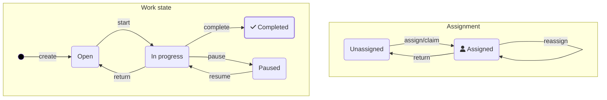

# Introduction to task applications — Task lifecycle

Every task follows a task life cycle. In the typical task life cycle, a task can, for example:

- Be **created**, but not yet assigned
- Be **assigned** and ready to work
- Be **open** or **started**
- Be **paused** and marked with a follow-up date
- Be **delegated** to another user
- Be **completed** or **canceled**

Before you create your task application, you should be clear about [which task lifecycle is suitable for your use case](https://docs.camunda.io/docs/next/apis-tools/frontend-development/01-task-applications/02-user-task-lifecycle).

The lifecycle of human task orchestration is mostly a generic issue. There is no need to model common aspects into all your processes, as this often makes models unreadable. Use Camunda task management features or implement your requirements in a generic way.

Learn how to define and implement your task lifecycle on the [user task lifecycle](https://docs.camunda.io/docs/next/apis-tools/frontend-development/01-task-applications/02-user-task-lifecycle) page.

---
Source: https://docs.camunda.io/docs/next/apis-tools/frontend-development/01-task-applications/01-introduction-to-task-applications
