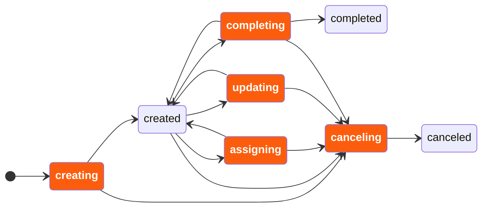

# User task lifecycle

Understand and decide on the lifecycle of user tasks in your application.

The user task lifecycle in Camunda defines how users interact with tasks and perform work. Define it before implementing your application logic and user interface.

## Define your task lifecycle

Define your task lifecycle based on your use case, the users interacting with the task, and the data you want to track.

Use the following task lifecycle as a starting point.

## Task lifecycle example

[Tasklist](https://docs.camunda.io/docs/next/components/tasklist/introduction-to-tasklist) implements a lifecycle optimized for tracking work on individual tasks using [forms](https://docs.camunda.io/docs/next/apis-tools/frontend-development/03-forms/01-introduction-to-forms). It separates assignment from task state to support collaborative processes.

In a typical flow, users can:

- Get assigned to a task, or assign the task to themselves.
- Start working on the task.
- Complete the task when the work is done.
- Pause, resume, or return the task if they can't continue work, depending on how your task application handles interrupted work.

If your application supports interrupted work, make sure it explicitly persists any draft or intermediate data before users leave the form.

The engine derives the task state using a CQRS pattern. [Zeebe](https://docs.camunda.io/docs/next/components/zeebe/zeebe-overview), Camunda's process execution engine, manages a stream of events. There is no single status attribute on tasks. Instead, the task status is derived from these events.

User task listeners run in a blocking manner. The lifecycle transition pauses until all listeners complete.

Listeners can also deny certain transitions. During `completing`, a listener can reject the transition and return the task to its previous state.

**Tip**
Optimize currently tracks assigned and unassigned time for user tasks. If you need more detailed reporting, such as work started, paused, resumed, or returned, model these as custom `action` values and process them in your own reporting or audit logic.

---
Source: https://docs.camunda.io/docs/next/apis-tools/frontend-development/01-task-applications/02-user-task-lifecycle
