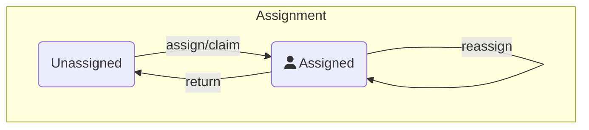

# User task lifecycle — Task assignment

Assignment runs independently of the work state, so tasks can be reassigned while work is in progress. A task may be assigned but remain open for some time, indicating that the assigned user is not available to work on it immediately. The assignee can also change while work is in progress.

In the Tasklist user interface, a task can be claimed by the logged-in user, which assigns the task to that user. Managers can assign unassigned tasks to team members and reassign them as needed.

The execution engine does not validate user authorization. Your application must enforce access control.

Tasklist allows only the assigned user or another authorized user to update and complete a task. You can implement different rules in your application, such as allowing a user to complete a task on behalf of another user.

In Camunda 8.9 and later, you can use [user task authorizations](https://docs.camunda.io/docs/next/components/tasklist/user-task-authorization) to control who can read, update, assign, or complete user tasks.

The following best practices are implemented in Tasklist:

- `update` and `complete` operations can only be performed by the assigned user or an admin or manager.
- Users can only see tasks assigned to them and tasks assigned to their candidate groups.
- When a task is returned to the queue, the assignee is cleared so another user can pick it up.
- Only authorized users can reassign tasks.
- Users can return tasks, but they must provide a comment explaining why.
- Users can mark tasks with a follow-up date. Depending on the assignment, the task remains assigned to the user or becomes unassigned.

Define validation logic that matches your use case.

---
Source: https://docs.camunda.io/docs/next/apis-tools/frontend-development/01-task-applications/02-user-task-lifecycle
