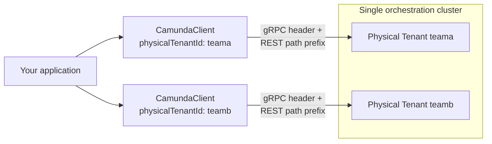

# Physical Tenants — Targeting multiple Physical Tenants

A single `CamundaClient` instance targets exactly one Physical Tenant. Multiplicity lives at the application layer, not inside the client — to interact with multiple Physical Tenants, create one client instance per tenant:



```java
CamundaClient teamaClient = CamundaClient.newClientBuilder()
    .physicalTenantId("teama")
    .build();

CamundaClient teambClient = CamundaClient.newClientBuilder()
    .physicalTenantId("teamb")
    .build();
```

If you're using the [Camunda Spring Boot Starter](https://docs.camunda.io/docs/next/apis-tools/camunda-spring-boot-starter/getting-started), it manages multiple named client instances for you — see [multi-client configuration](https://docs.camunda.io/docs/next/apis-tools/camunda-spring-boot-starter/configuration#multi-client-configuration-physical-tenants) — rather than constructing and managing `CamundaClient` instances directly.

---
Source: https://docs.camunda.io/docs/next/apis-tools/java-client/physical-tenants
