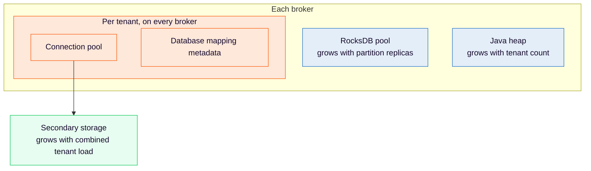

# Size clusters with Physical Tenants — Understand the sizing model

Tenants share brokers, gateways, and actor threads, but each tenant brings its own partitions, exporters, and secondary storage connections. The default tenant counts as a tenant in every formula on this page.

| Resource                                    | Scales with                                                      |
| :------------------------------------------ | :--------------------------------------------------------------- |
| Engine CPU, replication, and broker disk    | Total partitions and throughput across all tenants               |
| RocksDB memory (native)                     | Partition replicas per broker, across all tenants                |
| Java heap (RDBMS)                           | Tenant count, on every broker, regardless of partition placement |
| RDBMS connections                           | Brokers × tenants × pool size                                    |
| Secondary storage capacity                  | Combined load of all tenants that share an instance or cluster   |
| Elasticsearch/OpenSearch indices and shards | Tenants that share a cluster, each with its own index prefix     |
| CPU throttling and thread count             | Tenant count, because each adds stream processors and exporters  |

To see which infrastructure tenants share, read [what is not isolated](https://docs.camunda.io/docs/next/self-managed/concepts/physical-tenants/index#what-is-not-isolated).

---
Source: https://docs.camunda.io/docs/next/components/best-practices/architecture/sizing-physical-tenants
