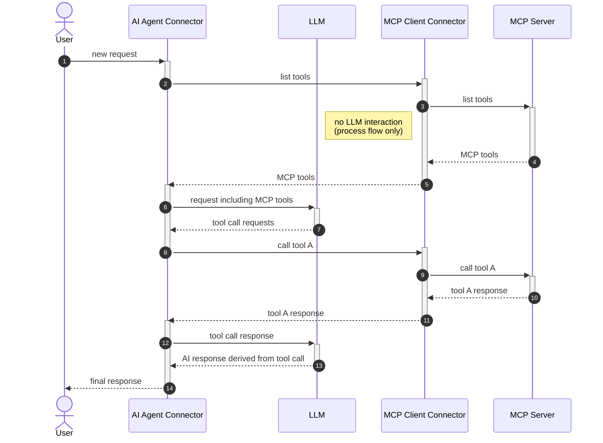

# MCP Client tool discovery

Learn how AI agents use gateway tool definitions to automatically discover and invoke MCP client tools.

Learn how AI agents use gateway tool definitions to automatically discover and invoke MCP client tools, enabling distributed, advanced BPMN workflows.

## About

AI agents can detect and use tools provided by MCP clients via activities within an ad-hoc sub-process. This is made possible by so-called [_gateway tool definitions_](https://docs.camunda.io/docs/next/components/connectors/out-of-the-box-connectors/agentic-ai-aiagent-tool-definitions#gateway-tool-definitions), which provide access to a list of tools instead of a single tool definition.

Tool discovery and calling are performed within the ad-hoc sub-process, rather than directly in the AI agent. This enables:

- Running the AI agent and individual MCP clients in different deployments. For example, a custom MCP client interacting with a local filesystem could be connected to a Camunda 8 SaaS instance.
- More advanced modeling use cases involving other BPMN elements. For example, user tasks can be used to combine MCP clients with an approval flow for individual tool calls. See [Human in the loop](https://docs.camunda.io/docs/next/components/connectors/out-of-the-box-connectors/agentic-ai-mcp-client-human-in-the-loop) for more details.

The following sequence diagram illustrates the process of tool discovery and calling with MCP clients. Each actor in the diagram can potentially run in a different deployment, making the architecture truly distributed:

---
Source: https://docs.camunda.io/docs/next/components/connectors/out-of-the-box-connectors/agentic-ai-mcp-client-tool-discovery
