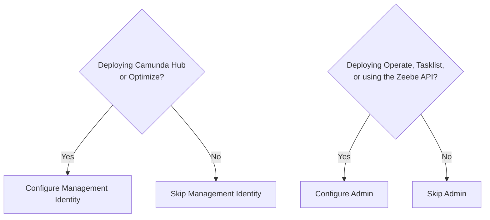

# How identity works in Camunda — Configure the identity subsystems

If you are deploying the full Camunda Self-Managed stack, you configure both subsystems, in this order:

1. **Management Identity first**: configure your IdP connection and verify users can log in to Camunda Hub.
2. **Admin second**: configure a separate IdP application registration and verify users can log in to Operate and Tasklist.

If you are deploying only the Orchestration Cluster (Operate, Tasklist, Zeebe) without the management plane, you only need to configure Admin.

For most full deployments, configure both Management Identity and Admin.

If you deploy with the Helm chart and your IdP presents a certificate signed by a private or internal certificate authority, Camunda components don't trust certificates signed by that CA by default. This can cause `PKIX path building failed` errors.

Configure [TLS trust](https://docs.camunda.io/docs/next/self-managed/deployment/helm/configure/tls#external-oidc-issuer-with-private-ca) before connecting either subsystem to your IdP.

---
Source: https://docs.camunda.io/docs/next/self-managed/components/identity/how-identity-works
