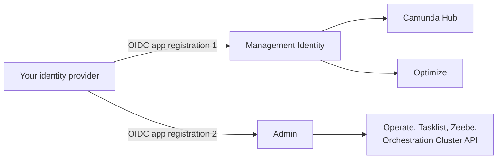

# How identity works in Camunda

Camunda Self-Managed uses two separate identity subsystems. Learn which one controls what, and which one you need to configure.

Camunda Self-Managed uses two separate identity subsystems.

Understanding which subsystem controls what helps you avoid a common misconfiguration. If you connect your identity provider (IdP) to one system but not the other, some components authenticate while others don't.

## The two identity subsystems

| Subsystem                                                                           | Governs                                                                                                         | Controls                                                                                                                                                                                      |
| :---------------------------------------------------------------------------------- | :-------------------------------------------------------------------------------------------------------------- | :-------------------------------------------------------------------------------------------------------------------------------------------------------------------------------------------- |
| **[Management Identity](https://docs.camunda.io/docs/next/self-managed/components/management-identity/overview)** | [Camunda Hub](https://docs.camunda.io/docs/next/self-managed/components/hub/index), [Optimize](https://docs.camunda.io/docs/next/self-managed/components/optimize/overview) | Who can log in, organization/project membership, role assignments                                                                                                                             |
| **[Admin](https://docs.camunda.io/docs/next/self-managed/components/orchestration-cluster/admin/overview)**       | Operate, Tasklist, Zeebe, Orchestration Cluster API (per cluster)                                               | Who can log in, role assignments, machine-to-machine (M2M) credentials, fine-grained resource-level authorizations (for example, access to specific process definitions, decisions, or tasks) |

For the full breakdown, see [Admin vs Management Identity](https://docs.camunda.io/docs/next/self-managed/reference-architecture/reference-architecture#admin-vs-management-identity).

In most deployments, both subsystems share the same IdP. You create a separate OIDC application registration for each subsystem but manage users in one place at the IdP level.

---
Source: https://docs.camunda.io/docs/next/self-managed/components/identity/how-identity-works
