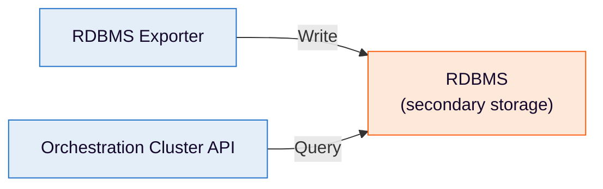

# Relational databases

Learn how relational databases work in Camunda 8 Self-Managed as a core Orchestration Cluster capability and navigate to setup, support, and configuration guides.

Relational database (RDBMS) support is a core capability of the Orchestration Cluster in Camunda 8 Self-Managed.

RDBMS is a standard secondary storage option for Orchestration Cluster installations, alongside Elasticsearch and OpenSearch.

With RDBMS secondary storage, the RDBMS exporter writes orchestration data to your relational database, and the Orchestration Cluster API queries it. Operate, Tasklist, and Admin use that API rather than querying the database directly.

In this context:

- [Primary storage](https://docs.camunda.io/docs/next/reference/glossary#primary-storage) is the broker-managed store for workflow execution state management.
- [Secondary storage](https://docs.camunda.io/docs/next/reference/glossary#secondary-storage) is an external store used for indexing, querying, analytics, and retention.

For a deeper conceptual comparison, see [understanding primary vs secondary storage](https://docs.camunda.io/docs/next/self-managed/concepts/secondary-storage/no-secondary-storage#about-this-mode).

---
Source: https://docs.camunda.io/docs/next/self-managed/concepts/databases/relational-db/index
