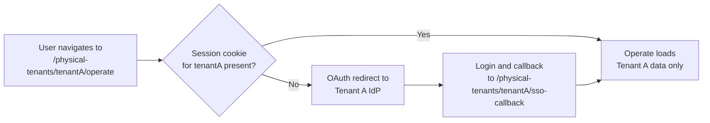

# API routing for Physical Tenants — Webapp routing

Camunda web applications (Operate, Tasklist, and Admin) follow the same path convention:

| Web app  | URL pattern                                     | Example                                                         |
| :------- | :---------------------------------------------- | :-------------------------------------------------------------- |
| Operate  | `/physical-tenants/{physicalTenantId}/operate`  | `https://your-cluster/physical-tenants/riskproduction/operate`  |
| Tasklist | `/physical-tenants/{physicalTenantId}/tasklist` | `https://your-cluster/physical-tenants/riskproduction/tasklist` |
| Admin    | `/physical-tenants/{physicalTenantId}/admin`    | `https://your-cluster/physical-tenants/riskproduction/admin`    |

All data shown is scoped to that one Physical Tenant. No cross-tenant data appears within a single web app session. There is no global tenant switcher dropdown. To switch Physical Tenants, navigate to the target tenant's URL. Each tenant loads its own isolated session.

### Access flow

### Session behavior

Each Physical Tenant has its own path-scoped session cookie, so sessions from different tenants do not interfere. See [session isolation](https://docs.camunda.io/docs/next/self-managed/concepts/physical-tenants/authentication-authorization#session-isolation) for the cookie-scoping details.

- **Simultaneous access**: users can be logged into multiple Physical Tenants at once using different browser tabs.
- **Logout**: completes per Physical Tenant. Navigate to the target tenant's logout endpoint to end that tenant's session.
- **Role changes mid-session:** Changing a user's roles does not invalidate their Operate or Tasklist session or log them out. The resolved authentication context, including role, group, and tenant membership, is cached in the HTTP session and re-resolved after `camunda.security.authentication.authentication-refresh-interval` (default `PT30S`) elapses. Permission changes are evaluated per request and take effect as soon as they reach secondary storage. Role or group changes sourced from IdP token claims are only picked up after the access token refreshes or the user logs in again.

For Optimize deployment guidance, see [Optimize deployment](https://docs.camunda.io/docs/next/self-managed/concepts/physical-tenants/index#optimize-deployment) and [Optimize and Physical Tenants](https://docs.camunda.io/docs/next/self-managed/concepts/physical-tenants/optimize).

---
Source: https://docs.camunda.io/docs/next/self-managed/concepts/physical-tenants/api-routing
