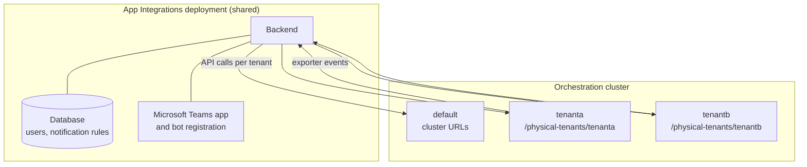

# App Integrations and Physical Tenants — How App Integrations resolves the Physical Tenant

App Integrations resolves a tenant independently on each of its four paths.

**Outbound API calls** are issued against the tenant's own orchestration URL, derived as `<cluster-url>/physical-tenants/<physicalTenantId>` unless the tenant configures an explicit one. The `default` tenant uses the cluster URL unchanged.

**Inbound exporter events** carry their tenant in the `X-Physical-Tenant-Id` header. When the header is absent, App Integrations falls back to the tenant whose `exporter.apiKey` authenticated the request, and finally to `default`. See [event routing](#event-routing-and-notifications).

**Inbound connector calls** carry the same header. The App Integrations connector reads the tenant from the job it is executing, so a linked form is fetched from that tenant's orchestration endpoint. See [connector calls](#connector-calls).

**User context** is the `(organization, cluster, Physical Tenant)` triple stored per user. It determines which tenant a chat command reads from, and which tenant a new notification rule is scoped to.

---
Source: https://docs.camunda.io/docs/next/self-managed/concepts/physical-tenants/app-integrations
