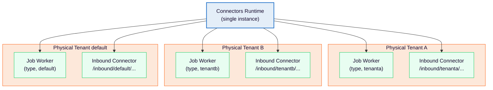

# Connectors runtime: Physical Tenant support

Configure one Connectors runtime instance to serve multiple Physical Tenants, with per-tenant job workers, opt-in secret scoping, and inbound webhook routing.

## About

Learn how one Connectors runtime instance can serve multiple Physical Tenants with tenant-specific clients, workers, secrets, and inbound paths.

## Architecture

---
Source: https://docs.camunda.io/docs/next/self-managed/concepts/physical-tenants/connectors-runtime
