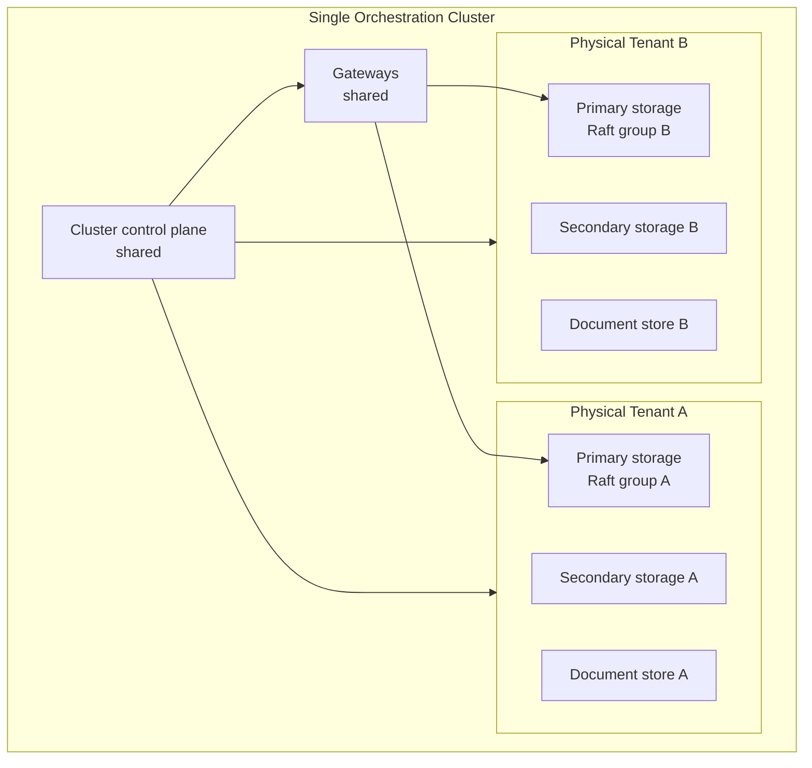

# Physical Tenant isolation model — Architecture

The diagram shows one Orchestration Cluster boundary with shared control-plane components and tenant-specific execution and storage boundaries.

The same isolation extends to authentication and authorization, and web apps. Each Physical Tenant authenticates through its own identity provider, gets its own Operate, Tasklist, and Admin, and its own backup and restore, while Logical Tenants remain available for lightweight subdivision inside each one:

---
Source: https://docs.camunda.io/docs/next/self-managed/concepts/physical-tenants/index
