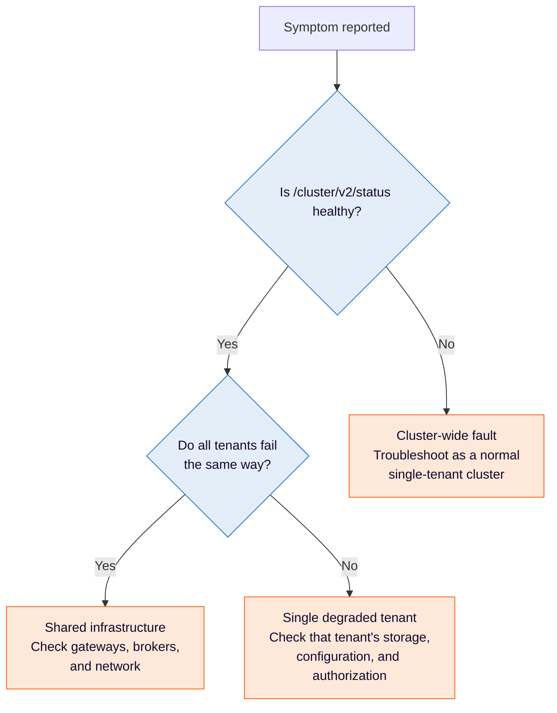

# Troubleshoot Physical Tenants

Diagnose startup, routing, authorization, storage, and performance problems in an Orchestration Cluster running multiple Physical Tenants.

## About

Learn how to diagnose problems specific to running multiple Physical Tenants in one Orchestration Cluster, and separate them from general cluster faults.

Most symptoms in a multi-tenant cluster fall into one of two categories: the whole cluster is unhealthy, or a single Physical Tenant is degraded while its peers keep serving traffic. Start by determining which one you have, because the two have different causes and different fixes.

## Determine the scope of the problem

Use these endpoints to answer the questions above:

| Endpoint                             | Scope   | Tells you                                                                                      |
| :----------------------------------- | :------ | :--------------------------------------------------------------------------------------------- |
| `/cluster/v2/status`                 | Cluster | Whether the cluster as a whole is operational. Requires no credentials.                        |
| `/cluster/v2/topology`               | Cluster | Physical Tenant topology and per-tenant status. Requires cluster-admin.                        |
| `/physical-tenants/{id}/v2/topology` | Tenant  | Whether one tenant can accept work, and which partitions are available.                        |
| `/actuator/cluster`                  | Cluster | Cluster topology, plus `pendingChange` and `lastChange` for configuration changes in progress. |
| `/actuator/health`                   | Node    | Whether an individual broker or gateway node is healthy.                                       |

`/physical-tenants/{id}/v2/topology` is the tenant-prefixed form of `/v2/topology`, not a separate endpoint. An unprefixed `/v2/topology` request returns the `default` tenant's topology only; for the cluster-wide aggregate, use `/cluster/v2/topology`.

The `/cluster/v2/...` and `/physical-tenants/...` endpoints are served on the Gateway REST port, 8080 by default. The `/actuator/...` endpoints are served on the management port, 9600 by default.

If `/cluster/v2/status` is healthy but one tenant is failing, the problem is scoped to that tenant. Troubleshoot it with the sections below rather than treating it as a cluster outage.

---
Source: https://docs.camunda.io/docs/next/self-managed/concepts/physical-tenants/troubleshooting
