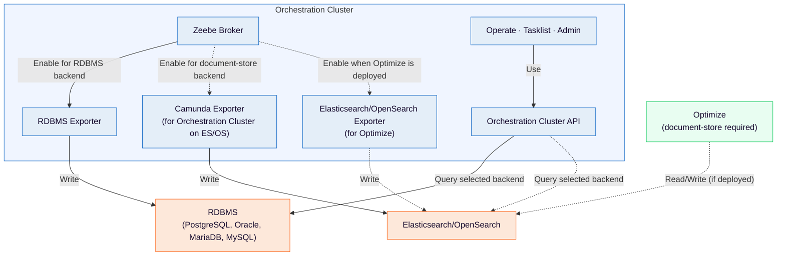

# Secondary storage — Supported storage options

Camunda supports multiple secondary storage backends. Both document-store and RDBMS backends are valid choices in Self-Managed deployments. Support maturity can vary by product area and version (for example, the Orchestration Cluster API, Operate, Tasklist, Admin, or Optimize), so confirm current compatibility details before choosing a backend. For supported database versions, see the [RDBMS version support policy](https://docs.camunda.io/docs/next/self-managed/concepts/databases/relational-db/rdbms-support-policy).

| Database type          | Availability         | Use case                                                                                                                                                                                          |
| :--------------------- | :------------------- | :------------------------------------------------------------------------------------------------------------------------------------------------------------------------------------------------ |
| Document-store (ES/OS) | General availability | Secondary storage for indexing, search, and analytics.                                                                                                                                            |
| RDBMS                  | 8.9+                 | Secondary storage for relational database deployments. See the [RDBMS support policy](https://docs.camunda.io/docs/next/self-managed/concepts/databases/relational-db/rdbms-support-policy) for supported vendors and versions. |

**Info: OpenSearch support**
Camunda 8 supports both [Amazon OpenSearch](https://aws.amazon.com/opensearch-service) and the open-source [OpenSearch](https://opensearch.org/) distribution.

**Note**
Starting in 8.9, Camunda 8 Run and default lightweight installs use H2 as the default secondary storage. Elasticsearch remains a supported alternative in Camunda 8 Run. OpenSearch and RDBMS-based secondary storage are supported in Self-Managed deployments. Enable the backend you need explicitly when required.

H2 is a convenience default for local development, testing, and evaluation. It is not a production reference architecture and is not a valid backend for multi-broker Helm clusters.

---
Source: https://docs.camunda.io/docs/next/self-managed/concepts/secondary-storage/index
