# Dual-region setup (ECS Fargate)

Reference architecture for Camunda 8 Self-Managed on AWS ECS Fargate in an active-active dual-region configuration backed by Aurora Global Database.

This reference architecture deploys Camunda 8 Self-Managed across two AWS regions on ECS Fargate in an active-active configuration, with Aurora Global Database as secondary storage and Camunda 8.10 unified `/v2/*` REST API.

**Note: Reference architecture**
This guide covers the **Orchestration Cluster** and Connectors.

## What you get

The reference architecture creates two identically configured ECS Fargate clusters, one per AWS region, with Zeebe brokers distributed across both regions.

- Active-active deployment across two AWS regions (default `eu-west-2` and `eu-west-3`; pick your own pair).
- Eight Zeebe brokers (four per region) with `cluster_size=8`, `replication_factor=4`, and `partition_count=8`. Asymmetric initial contact points use ECS Service Connect locally and the cross-region NLB for inter-region traffic.
- Aurora Global Database with a single writer endpoint per cluster, and with the [AWS JDBC Wrapper](https://github.com/aws/aws-advanced-jdbc-wrapper) `failover` plugin enabled for automatic reconnection after a writer change. PostgreSQL is the default engine; MySQL is available through [`db_engine`](#secondary-storage-engine).
- A zone-aware Zeebe cluster: each AWS region is a zone, and broker IDs take the form `<region>_<n>` (for example, `eu-west-2_0`). Failover and failback add or remove a whole zone through the [Zones API](https://docs.camunda.io/docs/next/self-managed/components/orchestration-cluster/zeebe/operations/management-api#zones-api).
- Cross-region connectivity via [VPC peering](https://docs.aws.amazon.com/vpc/latest/peering/what-is-vpc-peering.html) (recommended default) or [AWS Transit Gateway](https://aws.amazon.com/transit-gateway/) for Enterprise scenarios.
- [Route 53 Resolver](https://docs.aws.amazon.com/Route53/latest/DeveloperGuide/resolver.html) endpoints to forward Cloud Map service-discovery DNS queries across regions.
- Camunda 8.10 or later. The unified Orchestration Cluster `/v2/*` REST API requires Basic authentication; see [Verify connectivity to Camunda 8](#verify-connectivity-to-camunda-8).

**Note: Active-active scope**
Active-active in this guide refers to the Zeebe data plane: one stretched cluster whose brokers and partitions live in both regions, accepting and processing work concurrently from either region. The Aurora-backed secondary storage tier is active-standby: region 0 hosts the writer and region 1 hosts a cross-region reader. Promoting region 1 to writer is an explicit operator step during failover, not an automatic property of the deployment. See [Recover when the Aurora writer's region is lost](https://docs.camunda.io/docs/next/self-managed/deployment/containers/cloud-providers/amazon/aws-ecs-dual-region-ops#recover-when-the-aurora-writers-region-is-lost).

```mermaid

architecture-beta
    group regions(cloud)["Camunda dual region"]
    group r0(cloud)["Region 0 · eu-west-2"] in regions
    group r1(cloud)["Region 1 · eu-west-3"] in regions
    group aurora_global(logos:aws-rds)["Aurora Global Database"] in regions

    service ingress0(logos:aws-elb)["ALB and NLB ingress"] in r0
    service tasks0(logos:aws-ecs)["ECS Fargate workloads"] in r0
    service s3id0(logos:aws-s3)["S3 broker-ID lease"] in r0
    service s3bk0(logos:aws-s3)["S3 backup repository (shared)"] in r0
    service peer0(internet)["Cross-region link"] in r0

    service ingress1(logos:aws-elb)["ALB and NLB ingress"] in r1
    service tasks1(logos:aws-ecs)["ECS Fargate workloads"] in r1
    service s3id1(logos:aws-s3)["S3 broker-ID lease"] in r1
    service peer1(internet)["Cross-region link"] in r1

    service db_primary(logos:aws-rds)["Primary writer · eu-west-2"] in aurora_global
    service db_secondary(logos:aws-rds)["Secondary reader · eu-west-3"] in aurora_global
    db_primary:R --> L:db_secondary

    ingress0:B -- T:tasks0
    tasks0:L -- R:s3id0
    tasks0:B -- T:s3bk0
    tasks0:R -- L:peer0

    peer0{group}:R <--> L:peer1{group}
    peer0{group}:B --> T:db_primary{group}
    peer1{group}:B --> T:db_secondary{group}

    ingress1:B -- T:tasks1
    tasks1:R -- L:s3id1
    tasks1:L -- R:peer1
```

Both regions write backups to the single S3 backup bucket in region 0. Each region keeps its own S3 bucket for the broker-ID lease.

**Note**
This reference architecture is not a turnkey module. Clone the repository and adapt it to your environment — you are responsible for operating and maintaining the resulting infrastructure.

---
Source: https://docs.camunda.io/docs/next/self-managed/deployment/containers/cloud-providers/amazon/aws-ecs-dual-region
