# Deploy to Amazon ECS — Outcome

The result is a fully functioning Camunda Orchestration Cluster deployed in a high-availability setup using AWS ECS with Fargate and a managed Aurora PostgreSQL instance using IAM authentication. All ECS tasks share a single EFS volume dedicated to Camunda.

#### Architecture

The architecture outlined below describes a standard Zeebe three-node deployment, distributed across three [availability zones](https://aws.amazon.com/about-aws/global-infrastructure/regions_az/) within a single AWS region. It includes a managed Aurora PostgreSQL instance deployed under the same conditions. This approach ensures high availability and redundancy in case of a zone failure.

```mermaid

architecture-beta
    service users(internet)["Users and API clients"]

    group vpc(logos:aws-vpc)["VPC · single region · three availability zones"]
    group edge(cloud)["Public subnets · load balancers"] in vpc
    group cluster(logos:aws-ecs)["ECS cluster · Fargate services in private subnets"] in vpc
    group data(cloud)["Managed data services"] in vpc

    service alb(logos:aws-elb)["ALB · web apps and REST API"] in edge
    service nlb(logos:aws-elb)["NLB · gRPC"] in edge

    service cmap(logos:aws-route53)["Cloud Map · Service Connect"] in cluster
    service hub(logos:aws-fargate)["Camunda Hub"] in cluster
    service identity(logos:aws-fargate)["Management Identity"] in cluster
    service oc(logos:aws-fargate)["Orchestration Cluster"] in cluster
    service connectors(logos:aws-fargate)["Connectors"] in cluster

    service aurora(logos:aws-aurora)["Aurora PostgreSQL · secondary storage"] in data
    service efs(disk)["EFS · Zeebe primary storage"] in data
    service s3(logos:aws-s3)["S3 · node IDs and backups"] in data
    junction jstore in data

    users:B --> T:alb{group}
    alb:R -- L:nlb

    cmap:R -- L:hub
    hub:R -- L:identity
    identity:R -- L:oc
    oc:R -- L:connectors

    alb{group}:B --> T:oc{group}

    oc:B --> T:jstore{group}
    jstore:R -- L:s3
    jstore:B -- T:efs
    jstore:L -- R:aurora

    identity:B --> T:aurora{group}
    hub:B --> L:aurora{group}
```

_Infrastructure diagram for the single-region ECS architecture. Management Identity and Camunda Hub are optional and are only deployed when you enable OIDC authentication._

Arrows show the direction of traffic. Users and API clients reach the load balancers, which route to the ECS services, and each service connects to the data services it uses: the Orchestration Cluster uses EFS, S3, and the `camunda` database, while Management Identity and Camunda Hub each use a dedicated database on the same Aurora cluster. All four services register with [AWS Cloud Map](https://docs.aws.amazon.com/AmazonECS/latest/developerguide/service-connect.html) for internal service-to-service discovery, so they reach each other by name inside the VPC without going through the load balancer. Every component also reads its credentials from AWS Secrets Manager and writes logs to Amazon CloudWatch, which are omitted from the diagram to keep it readable.

After completing this guide, you will have:

- A [Virtual Private Cloud](https://docs.aws.amazon.com/vpc/latest/userguide/what-is-amazon-vpc.html) (VPC), which is a logically isolated virtual network.
  - A [Private Subnet](https://docs.aws.amazon.com/vpc/latest/userguide/configure-subnets.html), which does not have direct internet access.
  - [Elastic Container Service (ECS) Cluster](https://docs.aws.amazon.com/AmazonECS/latest/developerguide/clusters.html)
    - ECS Services for the Orchestration Cluster and Connectors, and optionally for Management Identity and Camunda Hub
      - These spawn ECS tasks running on [Fargate](https://aws.amazon.com/fargate/)
    - [Elastic File System (EFS)](https://aws.amazon.com/efs/) as primary datastore for the Zeebe cluster
    - [Aurora PostgreSQL](https://aws.amazon.com/rds/aurora/) as secondary datastore
  - A [Public Subnet](https://docs.aws.amazon.com/vpc/latest/userguide/configure-subnets.html), which has internet access via an [Internet Gateway](https://docs.aws.amazon.com/vpc/latest/userguide/VPC_Internet_Gateway.html).
    - (Optional) An [Application Load Balancer](https://docs.aws.amazon.com/elasticloadbalancing/latest/application/introduction.html) (ALB) to expose web interfaces such as Operate, Tasklist, Connectors, and the Orchestration Cluster REST API. This uses sticky sessions, as requests are otherwise distributed round-robin across ECS instances.
    - (Optional) A [Network Load Balancer](https://docs.aws.amazon.com/elasticloadbalancing/latest/network/introduction.html) (NLB) to expose the gRPC endpoint of the Zeebe Gateway, if external applications need to connect.
- [Security Groups](https://docs.aws.amazon.com/vpc/latest/userguide/vpc-security-groups.html) to control network traffic to and from the ECS instances.
- An [Internet Gateway](https://docs.aws.amazon.com/vpc/latest/userguide/VPC_Internet_Gateway.html) to route traffic between the VPC and the internet.
- An [S3 bucket](https://aws.amazon.com/s3/) used by the Orchestration Cluster’s ECS-specific node-id provider.
- A versioning-enabled [S3 bucket](https://aws.amazon.com/s3/) for backups.
  - Use a separate bucket for backups. The node-id bucket has versioning disabled because frequent metadata changes would incur additional cost without any benefit.
- [AWS Secrets Manager](https://aws.amazon.com/secrets-manager/) for application credentials and optional container registry credentials.
- [AWS CloudWatch](https://aws.amazon.com/cloudwatch/) for logs.
- [ECS Service Connect](https://docs.aws.amazon.com/AmazonECS/latest/developerguide/service-connect.html) to connect ECS services directly with each other.
- [IAM authentication](https://docs.aws.amazon.com/AmazonRDS/latest/UserGuide/UsingWithRDS.IAMDBAuth.html) to connect the Orchestration Cluster with the Aurora PostgreSQL cluster.

---
Source: https://docs.camunda.io/docs/next/self-managed/deployment/containers/cloud-providers/amazon/aws-ecs
