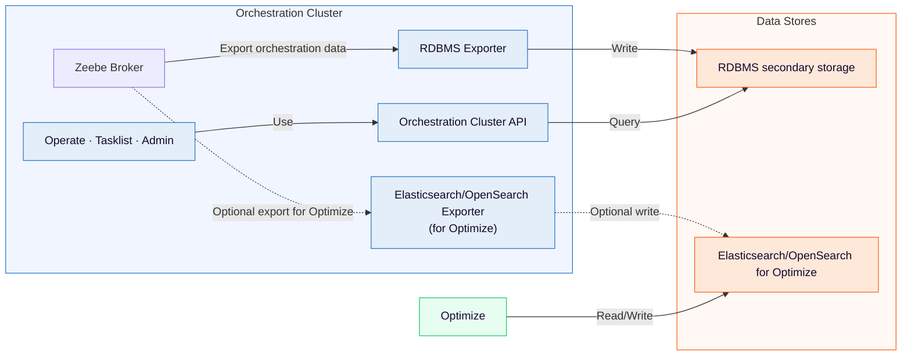

# Manual installation with RDBMS

Install Camunda 8 manually on VMs or bare metal with RDBMS as secondary storage.

Install Camunda 8 Self-Managed manually on a VM, bare-metal server, or standalone Java runtime while using a relational database (RDBMS) as **secondary storage**.

**Caution**
Manual installation is **not** supported for Kubernetes. If you run on Kubernetes, use the [Helm charts](https://docs.camunda.io/docs/next/self-managed/deployment/helm/index).

## Manual deployment data flow

For backend trade-offs and production architecture decisions, see [secondary storage architecture](https://docs.camunda.io/docs/next/self-managed/reference-architecture/reference-architecture#secondary-storage-architecture).

In this manual deployment path, the Orchestration Cluster reads from a single configured secondary storage type: RDBMS. However, the Zeebe Broker can export to multiple targets simultaneously. If you deploy Optimize, configure both the RDBMS exporter (for Orchestration Cluster operations) and an Elasticsearch/OpenSearch exporter for Optimize.

**Key points:**

- Operate, Tasklist, and Admin use the Orchestration Cluster API rather than reading directly from secondary storage. The Orchestration Cluster API reads from the configured secondary storage (RDBMS).
- Optimize requires Elasticsearch or OpenSearch and reads and writes directly to it.
- The Zeebe Broker can export to multiple targets simultaneously to support this architecture.

---
Source: https://docs.camunda.io/docs/next/self-managed/deployment/manual/rdbms/index
