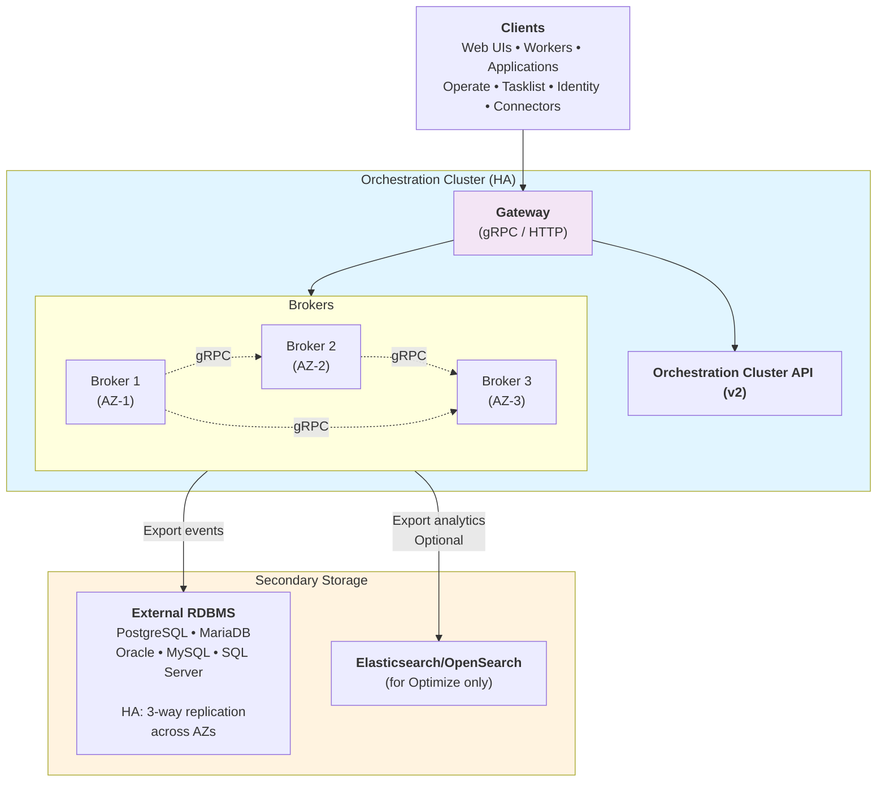

# Production architecture for Camunda 8 with RDBMS — Example topology

For production deployments with RDBMS, Camunda recommends a **HA Zeebe cluster backed by an external managed RDBMS**:

### Key characteristics

#### Clustering

- Minimum three brokers for production HA
- Each broker in separate availability zone
- Default replication factor 3 (spans AZs)

#### Secondary storage

- Single external managed RDBMS instance
- Database handles replication and failover
- Camunda does not manage database HA

#### Data flow

- Processes are executed
- State is flushed to RDBMS
- Orchestration Cluster applications (Operate, Tasklist, and Identity) and API clients access data through the Orchestration Cluster interfaces; they do not directly access secondary storage

---
Source: https://docs.camunda.io/docs/next/self-managed/deployment/manual/rdbms/rdbms-production-architecture
