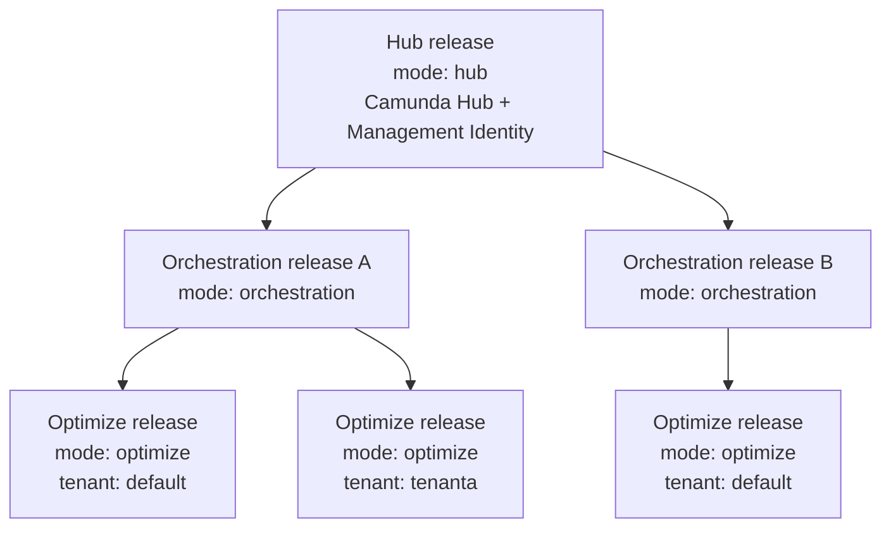

# Camunda 8.10 deployment topology — How the planes fit together

One Hub release serves any number of Orchestration Clusters. Each cluster hosts one or more Physical Tenants, and each tenant is served by exactly one Optimize release.

Optimize is one-to-one with a Physical Tenant because it reads exported records from a single index prefix. A tenant without its own Optimize release has no analytics; an Optimize release pointed at two tenants reads only one of them.

The default Physical Tenant counts. Every Orchestration Cluster has one, created at provisioning time, and it needs its own Optimize release like any other tenant.

---
Source: https://docs.camunda.io/docs/next/self-managed/reference-architecture/deployment-topology
