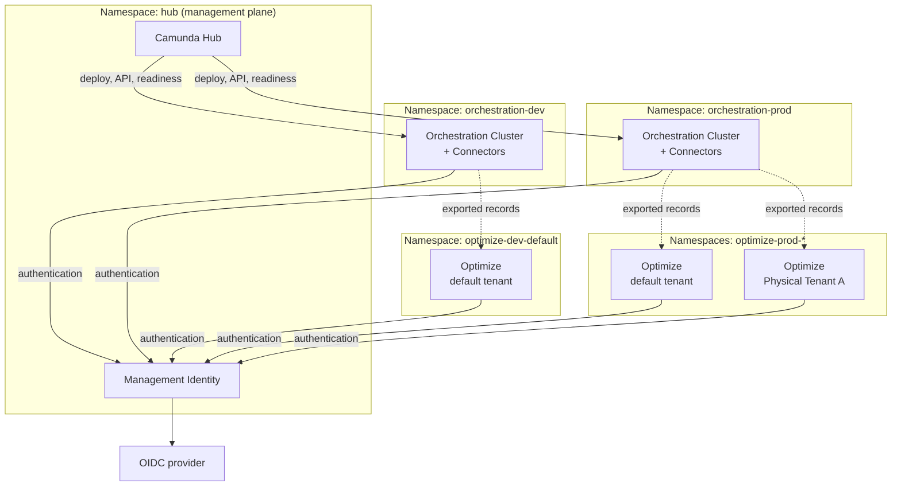

# Kubernetes deployment overview — Architecture — Components

Camunda 8 deployments separate workloads into three logical groups, each installed as its own Helm release with a `global.topology.mode` role:

- **Management plane:** Camunda Hub and Management Identity (`hub`), one per deployment
- **Orchestration Cluster:** Orchestration Cluster and Connectors (`orchestration`), one per cluster
- **Optimize:** one release per Physical Tenant (`optimize`)

Deploy these groups into separate [Kubernetes namespaces](https://kubernetes.io/docs/concepts/overview/working-with-objects/namespaces/). The Hub namespace isn't tied to a single environment, and Orchestration Cluster namespaces can run on the same or different Kubernetes clusters, as long as every configured URL is reachable from the release that uses it. Deploying all components in a single `combined` release remains supported, and suits evaluation and smaller environments.

<!-- TODO: Replace this Mermaid diagram with a designed diagram. -->

For the required cross-namespace traffic, see [allow required network traffic](https://docs.camunda.io/docs/next/self-managed/deployment/helm/install/topology/index#allow-required-network-traffic). To implement this topology with the Helm chart, see [install the deployment topology](https://docs.camunda.io/docs/next/self-managed/deployment/helm/install/topology/index).

#### Management plane namespace

As shown in the [architecture diagram](#management-plane), this namespace contains:

- [Camunda Hub](https://docs.camunda.io/docs/next/components/hub/index) — modeling and administrative capabilities
- [Management Identity](https://docs.camunda.io/docs/next/self-managed/components/management-identity/overview) — centralized access control for Camunda Hub and Optimize

This namespace also requires an OIDC-compatible Identity Provider (IdP) for Management Identity. You can use any compatible provider (for example, Keycloak deployed via the [Keycloak Operator](https://docs.camunda.io/docs/next/self-managed/deployment/helm/configure/operator-based-infrastructure#keycloak-deployment) or Microsoft Entra ID).

**Tip: Why isn't an IdP included by default?**
The choice of identity provider is highly specific to each organization's security requirements, existing infrastructure, and compliance needs. Rather than bundling a default IdP that may not match your setup, the reference architecture leaves this choice to you. This approach gives you full control over your authentication stack and avoids unnecessary complexity for teams that already have an IdP in place.

**Warning: Identity separation**
Optimize and Camunda Hub rely on Management Identity (formerly Identity). This service is separate from the embedded Admin in the Orchestration Cluster and incompatible with it. To share the same user base and API clients across both, you must use OIDC.

For configuration details, see:

- [Connect Orchestration Cluster to an OIDC provider](https://docs.camunda.io/docs/next/self-managed/concepts/authentication/authentication-to-orchestration-cluster#oidc)
- [Connect Management Identity to an OIDC provider](https://docs.camunda.io/docs/next/self-managed/components/management-identity/configuration/connect-to-an-oidc-provider)

The Orchestration Cluster can be configured to authenticate with OIDC by connecting to the Management Identity service deployed in this namespace.

#### Orchestration Cluster namespace

As shown in the [architecture diagram](#orchestration-cluster), the Orchestration Cluster is deployed as a StatefulSet and packaged as a single container image. It includes the following components:

- [Zeebe](https://docs.camunda.io/docs/next/components/zeebe/zeebe-overview) — workflow engine and broker
- [Operate](https://docs.camunda.io/docs/next/components/operate/operate-introduction) — visibility and troubleshooting UI
- [Tasklist](https://docs.camunda.io/docs/next/components/tasklist/introduction-to-tasklist) — UI for human tasks
- [Admin](https://docs.camunda.io/docs/next/self-managed/components/orchestration-cluster/admin/overview) — authentication and access control

---
Source: https://docs.camunda.io/docs/next/self-managed/reference-architecture/kubernetes
