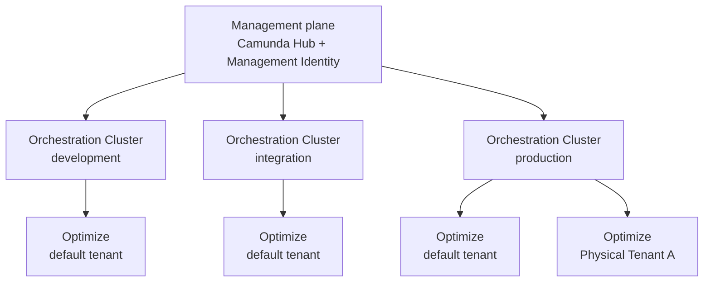

# Camunda 8 reference architectures — Architecture — Deployment topology

A Camunda 8 Self-Managed deployment is built around one [management plane](https://docs.camunda.io/docs/next/reference/glossary#management-plane), made up of Camunda Hub and Management Identity. The management plane serves one or more Orchestration Clusters, for example one per environment such as development, integration, and production. Each Orchestration Cluster hosts one or more [Physical Tenants](https://docs.camunda.io/docs/next/self-managed/concepts/multi-tenancy/physical-tenants), including the default tenant, and each tenant is served by its own Optimize instance.

<!-- TODO: Replace this Mermaid diagram with a designed diagram. -->

Each Orchestration Cluster is deployed, scaled, and upgraded on its own schedule, while the management plane maintains the cluster inventory and Management Identity permission and role configuration. With Keycloak, Management Identity also provisions workload clients. With Microsoft Entra ID or another generic OIDC provider, operators provision workload clients separately.

Physical Tenants isolate data within a cluster, and the topology is fully declarative, so it fits GitOps tooling such as Argo CD or Flux.

To implement this topology on Kubernetes, see [install the deployment topology](https://docs.camunda.io/docs/next/self-managed/deployment/helm/install/topology/index).

---
Source: https://docs.camunda.io/docs/next/self-managed/reference-architecture/reference-architecture
